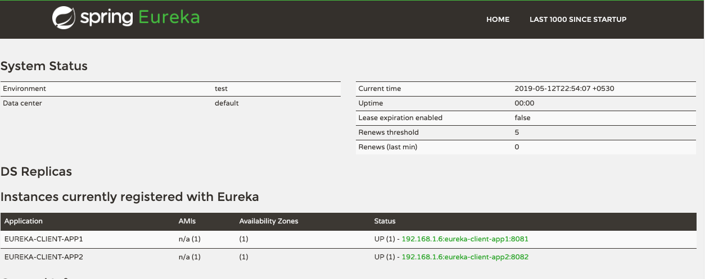

# springboot-microservices-workshop

This repository contains microservices samples built using spring boot and spring cloud application development frameworks.

### Projects :

<table>
 <tr>
    <th style="text-align:left">Name</th>
    <th style="text-align:left">Port</th> 
    <th style="text-align:left">Description</th>
  </tr>
  <tr>
    <td><a href="https://github.com/BarathArivazhagan/springboot-microservices-workshop/tree/master/eureka-server"> eureka-server</a></td>
    <td>8080</td>
    <td>Eureka service registration server </td>
  </tr>
  <tr>
    <td><a href="https://github.com/BarathArivazhagan/springboot-microservices-workshop/tree/master/eureka-client-app1">eureka-client-app1</a></td>
    <td>8081</td>
    <td>Eureka service discovery client registered with eureka-server</td>
  </tr>
  <tr>
    <td><a href="https://github.com/BarathArivazhagan/springboot-microservices-workshop/tree/master/eureka-client-app2">eureka-client-app2</a></td>
    <td>8082</td>
    <td>Eureka service discovery client registered with eureka-server</td>
  </tr>
  <tr>
    <td><a href="https://github.com/BarathArivazhagan/springboot-microservices-workshop/tree/master/zuul-proxy">zuul-proxy</a></td>
    <td>8085</td>
    <td>Zuul reverse proxy server acting as reverse proxy pass to other microservices</td>
  </tr>

  <tr>
    <td><a href="https://github.com/BarathArivazhagan/springboot-microservices-workshop/tree/master/config-server">config-server</a></td>
    <td>8888</td>
    <td>Configuration server acting as a hub for centralized configuration</td>
  </tr>
  
</table>

#### Compatability Matrix

choose the branch based on below maintained versions.

<table>
 <tr>
    <th style="text-align:left">Branch/Version</th>
    <th style="text-align:left">Spring Boot</th>
    <th style="text-align:left">Spring Cloud</th>
  </tr>
  <tr>
    <td>master</td>
    <td>2.1.5.RELEASE</td>
    <td>Greenwich.SR1</td>
  </tr>
  <tr>
    <td>1.0.x</td>
    <td>1.5.10.RELEASE</td>
    <td>Dalston.RELEASE</td>
  </tr>
  <tr>
    <td>1.1.x</td>
    <td>1.5.12.RELEASE</td>
    <td>Edgware.RELEASE</td>
  </tr>
  <tr>
    <td>2.0.x</td>
    <td>1.5.12.RELEASE</td>
    <td>Finchley.RELEASE</td>
  </tr>
  <tr>
    <td>2.1.x</td>
    <td>2.1.3.RELEASE</td>
    <td>Greenwich.RELEASE</td>
  </tr>
  <tr>
    <td>2.1.4</td>
    <td>2.1.4.RELEASE</td>
    <td>Greenwich.RELEASE</td>
  </tr>
  
</table>


#### Eureka Server Registration View :
 
 eureka-service : http://localhost:8080/ 

 
 

### How to run the project ? 

* Clone the repository

```sh
git clone https://github.com/BarathArivazhagan/springboot-microservices-workshop.git
```

* Execute below script to build all the applications

```sh 
cd springboot-microservices-workshop
./build.sh
```
* On windows, perform maven build
```
cd springboot-microservices-workshop
mvn clean package
```

* Start the applications

```sh

cd springboot-microservices-workshop
cd  eureka-server
./mvnw spring-boot:run

cd eureka-client-app1
./mvnw spring-boot:run

cd eureka-client-app2
./mvnw spring-boot:run

cd zuul-proxy
./mvnw spring-boot:run

cd config-server
./mvnw spring-boot:run

```

### Docker support

Take advantage of docker compose to quickly build and run applications as containers.

Note: Dont forget tochange the docker image names as per docker repository

* Build docker images
```Shell
$ docker-compose build
```

* Push the images to the repository

```Shell
$ docker-compose push
```

* Run the applications

```Shell
$ docker-compose up -d
```

### Kubernetes Support

To deploy the applications as docker containers inside kubernetes cluster

[Katacoda K8s Playground](https://www.katacoda.com/courses/kubernetes/playground)

```Shell
$ git clone https://github.com/BarathArivazhagan/springboot-microservices-workshop.git && cd k8s
$ kubectl create -f k8s.yaml

configmap/spring-config-map created
configmap/eureka-server-config-map created
configmap/config-server-config-map created
configmap/zuul-proxy-config-map created
deployment.apps/eureka-server created
deployment.apps/eureka-client-app1 created
deployment.apps/eureka-client-app2 created
deployment.apps/zuul-proxy created
deployment.apps/config-server created
service/eureka-server created
service/eureka-client-app1 created
service/eureka-client-app2 created
service/zuul-proxy created
service/config-server created
```

 
<b>Test the microservices in local </b>: 
 
```Shell
# eureka client app1 url

$ curl http://localhost:8081/

HELLO FROM EUREKA CLIENT 1

# eureka client app2 url

$ curl http://localhost:8082/

HELLO FROM EUREKA CLIENT 2

# zuul proxy url for eureka client app1 

$ curl http://localhost:8085/app1/

HELLO FROM EUREKA CLIENT 1

## zuul proxy url for eureka client app2

$ curl http://localhost:8085/app2/

HELLO FROM EUREKA CLIENT 2
```

  
<b>Test the microservices in K8s clsuter </b>: 

- verify the pods

```Shell
$ kubectl get pods
NAME                                  READY     STATUS      RESTARTS   AGE
config-server-798f96964f-8h2p7        1/1       Running     0          6m
eureka-client-app1-5f775d994d-mhqmt   1/1       Running     0          6m
eureka-client-app2-68c775f67b-9vvmq   1/1       Running     0          6m
eureka-server-6bb9ccd47f-l2m47        1/1       Running     0          6m
zuul-proxy-7c8f4597fd-lbrfd           1/1       Running     0          6m
```

- verify the services

```Shell
$ kubectl get services

NAME                 TYPE        CLUSTER-IP       EXTERNAL-IP   PORT(S)    AGE
config-server        ClusterIP   10.101.203.112   <none>        8888/TCP   7m
eureka-client-app1   ClusterIP   10.104.65.88     <none>        8081/TCP   7m
eureka-client-app2   ClusterIP   10.105.214.129   <none>        8082/TCP   7m
eureka-server        ClusterIP   10.109.231.205   <none>        8080/TCP   7m
kubernetes           ClusterIP   10.96.0.1        <none>        443/TCP    1h
zuul-proxy           ClusterIP   10.100.161.43    <none>        8085/TCP   7m
```

- Test the services 

```Shell
$ kubectl run debug -it --rm --restart=Never --image=barathece91/debug 

root@debug1:/# curl http://eureka-client-app1:8081
HELLO FROM EUREKA CLIENT 1

root@debug1:/# curl http://eureka-client-app2:8082
HELLO FROM EUREKA CLIENT 2

root@debug1:/# curl http://zuul-proxy:8085/app1/
<b>HELLO FROM EUREKA CLIENT 2</b>

root@debug1:/# curl http://zuul-proxy:8085/app2/
<b>HELLO FROM EUREKA CLIENT 2</b>
```

 
